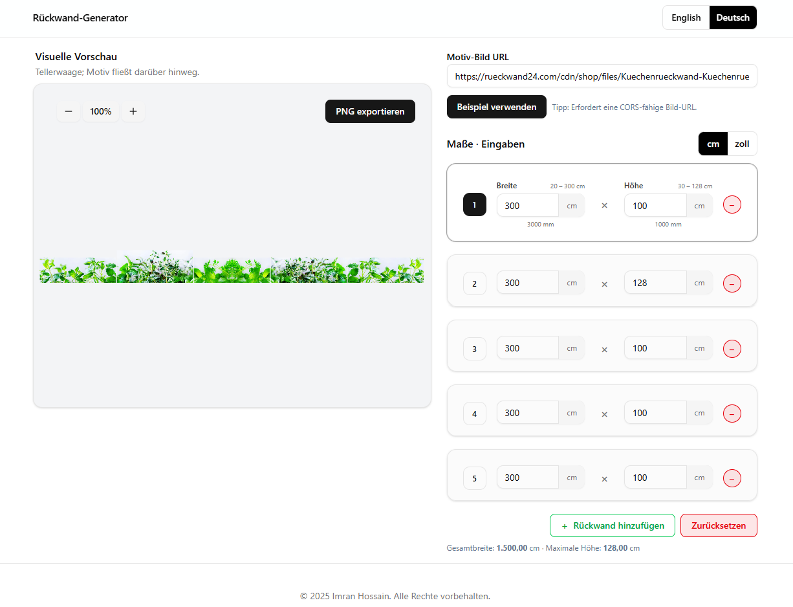

# Plate Generator

A React app to design a plate generator system for configuring and visualizing custom wall plates: enter plate dimensions in **cm/inch**, preview a **continuous motif** spanning all plates, and export a **PNG**. Supports **English/German** (react-intl).



> Tip: The preview supports **horizontal scroll** for wide layouts and **mirrors** the image for layouts wider than 300 cm to keep a seamless look.

---

## ✨ Features

- **Live visual preview** with smooth add/remove/resize animations
- **Continuous motif** across plates (`cover`/`contain`), optional tiling
- **Unit toggle**: centimeters ⇄ inches (with validation & locale formatting)
- **i18n**: English & German via **react-intl**
- **PNG export** of the preview canvas
- **Persistent config** (localStorage) with reset to defaults
- **Mobile-first**: horizontal scroll on overflow; no layout squish
- **Accessible**: keyboard focus/select on plate rows; ARIA labels on controls

---

## 🧱 Tech Stack

- **React 19**, **React Router**
- **Tailwind CSS** (dark mode via `class`)
- **react-intl** (FormatJS) for messages & number formatting
- **Canvas 2D** rendering (with clipping & robust source clamping)
- Local state + **localStorage** persistence hook

---

## 📦 Getting Started

### Prerequisites

- **Node.js** ≥ 18
- **npm** (or **pnpm**/**yarn**)

### Installation

```bash
# clone your repo (choose one)
# SSH (requires SSH key setup):
git clone git@github.com:ImranHossain1/plate-generator-task.git
# HTTPS (works everywhere):
git clone https://github.com/ImranHossain1/plate-generator-task.git

# install deps
npm install
# or: pnpm i / yarn
```

### Development

```bash
npm run dev
```

Open the printed local URL (usually `http://localhost:5173`).

### Production build

```bash
npm run build
npm run preview
```

---

## 🔗 Live Demo

[Live Server on Vercel](https://plate-generator-task.vercel.app/)

---

## 🗂️ Project Structure (excerpt)

```
src/
  components/
    cards/
      ConfigCard.jsx
      PreviewCard.jsx
    plates/
      MotifInput.jsx
      PlateCanvas.jsx
      PlateField.jsx
      PlateRow.jsx
      PlatesActions.jsx
      PlatesList.jsx
    ui/
      Button.jsx
      Card.jsx
      ToggleButton.jsx
      TextField.jsx
  constants/
    plates.js
  hooks/
    useImage.js
    usePersistentState.js
  i18n/
    en.json
    de.json
    LocaleContext.js
    LocaleProvider.jsx
    useLocale.js
    index.js
  pages/
    HomePage.jsx
  Routes/
    AppRouter.jsx
  utils/
    number.js
    plates.js
  main.jsx
  index.css
```

---

## 🌍 Internationalization (EN/DE)

- Provided by **react-intl**.
- Messages live in `src/i18n/en.json` and `src/i18n/de.json`.
- Wraps the app in `<LocaleProvider>` (see `main.jsx`).
- **Language toggle** is in the Navbar using `useLocale()` and `ToggleButton`.

**Number formatting**:

- Use `<FormattedNumber>` or `intl.formatNumber` to respect locale rules.
- Inputs parse localized numbers via `parseLocaleNumber`.

## 🖼️ Preview & Canvas Rendering

- Scale: **1 cm = 1 px** (auto horizontal scroll if overflow).
- **Center when it fits**, **scroll-left when it doesn’t** (desktop).
- **Always scroll** on mobile to avoid shrinking the UI.
- Robust `drawImageClamped` ensures safe cropping within image bounds.
- **Mirroring**: When the total width exceeds **300 cm**, builds an offscreen `[img | mirrored img]` stripe for seamless continuity.
- `Export PNG` button grabs the canvas and triggers a download.

> **CORS Note:** For remote images, the server must allow cross-origin access. Otherwise the canvas becomes tainted and PNG export will fail. Use the sample image or a CORS-enabled URL.

---

## ⚙️ Configuration & Limits

Defined in `src/constants/plates.js`:

```js
export const PLATE_LIMITS = {
  MIN_W: 20,
  MAX_W: 300,
  MIN_H: 30,
  MAX_H: 128,
  MAX_PLATES: 10,
};

export const DEFAULT_PLATE_CONFIG = {
  motifUrl: "https://…/sample.jpg",
  renderMode: "cover",
  plates: [
    { id: crypto.randomUUID(), w: 60, h: 100 },
    { id: crypto.randomUUID(), w: 60, h: 100 },
    { id: crypto.randomUUID(), w: 60, h: 100 },
  ],
};
```

---

## 🧪 Scripts

```json
{
  "scripts": {
    "dev": "vite",
    "build": "vite build",
    "preview": "vite preview --strictPort",
    "lint": "eslint .",
    "format": "prettier --write ."
  }
}
```

---

## 🧰 Development Notes

- **React Fast Refresh rule:** split i18n into `LocaleProvider` (component) and `useLocale` (hook) to satisfy `react-refresh/only-export-components`.
- Use `min-w-0` on grid/flex columns that should allow horizontal overflow instead of pushing siblings to shrink.
- Use `shrink-0` / `flex-none` on the `<canvas>` so it doesn’t resize the parent column.
- Prefer inline logic inside `useEffect` or memoize helpers with `useCallback` to keep exhaustive-deps happy.

---

## 🔧 Troubleshooting

- **PNG export fails**: likely a CORS issue. Try the **sample image** or host your image with proper `Access-Control-Allow-Origin`.
- **Layout shrinks on mobile**: ensure the preview wrapper has `overflow-x-auto` and the canvas uses `shrink-0`. The right config card column should be `md:flex-none` with a fixed width.
- **Numbers parse wrong**: check `parseLocaleNumber` and ensure you’re passing strings from inputs; use `<FormattedNumber>` for output.

---

## 🙌 Credits

Built by **Imran Hossain**.  
Localization via **react-intl**, styling via **Tailwind CSS**.

---
