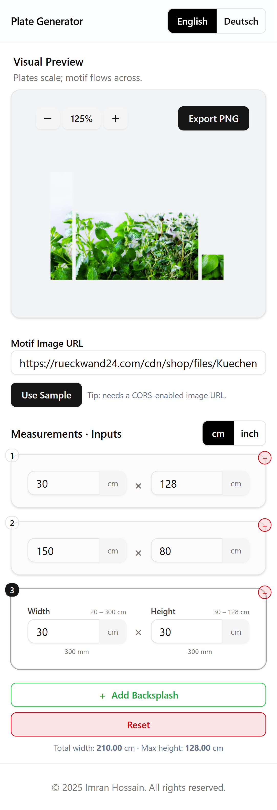

# Plate Generator

A React app to design a plate generator system for configuring and visualizing custom wall plates: enter plate dimensions in **cm/inch**, preview a **continuous motif** spanning all plates, and export a **PNG**. Supports **English/German** (react-intl).

Localization via **react-intl**, components via **shadcn/ui**, styling via **Tailwind CSS**.

<table align="center">
  <tr>
    <td align="center">
      <br/>
      <b>Desktop View</b>
    </td>
    <td align="center">
      <br/>
      <b>Mobile View</b>
    </td>
  </tr>
</table>

> Tip: The preview supports **horizontal scroll** for wide layouts and **mirrors** the image for layouts wider than 300 cm to keep a seamless look.

---

---

## 🔗 Live Demo

[Live Server on Vercel](https://plate-generator-task.vercel.app/)

## ✨ Features

- **Interactive drag & drop**: reposition the motif image directly in the preview using **dnd-kit**.
- **Live visual preview** with smooth add/remove/resize transitions (shadcn + Tailwind / Headless UI `Transition`).
- **Continuous motif** across plates.
- **Unit toggle**: centimeters ⇄ inches (with validation & locale formatting).
- **i18n**: English & German via **react-intl**.
- **PNG export** of the preview canvas.
- **Persistent config** (localStorage) with reset to defaults.
- **Mobile-first**: horizontal scroll on overflow; no layout squish.
- **Accessible**: keyboard focus/select on plate rows; ARIA labels on controls.

## 🧱 Tech Stack

- **React 19**, **TypeScript**, **Vite**
- **shadcn/ui** (Tailwind + Radix UI)
- **Tailwind CSS**
- **react-intl** (FormatJS) for messages & number formatting
- **dnd-kit** for drag-and-drop interactions in the preview
- **React-Konva (Konva)** for canvas rendering
- Local state + **localStorage** persistence hook

---

## 📦 Getting Started

### Prerequisites

- **Node.js** ≥ 18
- **npm** (or **pnpm**/**yarn**)

### Installation

```bash
# clone your repo (choose one)

# HTTPS (works everywhere):
git clone https://github.com/ImranHossain1/plate-generator-task.git

# install deps
npm install
# or: pnpm i / yarn
```

### Development

```bash
npm run dev
```

Open the printed local URL (usually `http://localhost:5173`).

### Production build

```bash
npm run build
npm run preview
```

---

## 🌍 Internationalization (EN/DE)

- Provided by **react-intl**.
- Messages live in `src/i18n/en.json` and `src/i18n/de.json`.
- The app is wrapped by a locale provider (see `main.tsx`).
- **Language toggle** via a shadcn toggle/button.

**Number formatting & parsing**

- Use `<FormattedNumber>` or `intl.formatNumber` for locale-aware output.
- Inputs parse localized numbers via `parseLocaleNumber`.

---

## 🖼️ Preview, Drag & Drop, and Rendering

- **Scale**: **1 cm = 1 px** (auto horizontal scroll if overflow).
- **Drag & drop**: the motif image can be repositioned using **dnd-kit** for intuitive cropping/alignment over the plate layout.
- **Rendering**: uses **React-Konva** (`Stage`, `Layer`, `Group`, `Image`) for high-performance canvas rendering.
- **Cropping**: global **cover-crop** plus per-plate **crop** calculations keep the motif continuous.
- **Mirroring**: when total width > **300 cm**, an offscreen `[img | mirrored img]` stripe provides a seamless continuation.
- **Export**: `Export PNG` captures the canvas and triggers the download.

> **CORS Note:** For remote images, the server must allow cross-origin access. Otherwise the canvas becomes tainted and PNG export will fail. Use the sample image or a CORS-enabled URL.

---

## ⚙️ Configuration & Limits

Defined in `src/constants/plates.ts`:

```ts
export const PLATE_LIMITS = {
  MIN_W: 20,
  MAX_W: 300,
  MIN_H: 30,
  MAX_H: 128,
  MAX_PLATES: 10,
};

export const DEFAULT_PLATE_CONFIG = {
  motifUrl:
    "https://rueckwand24.com/cdn/shop/files/Kuechenrueckwand-Kuechenrueckwand-Gruene-frische-Kraeuter-KR-000018-HB.jpg?v=1695288356&width=1200",
  plates: [
    { id: crypto.randomUUID(), w: 60, h: 100 },
    { id: crypto.randomUUID(), w: 60, h: 100 },
    { id: crypto.randomUUID(), w: 60, h: 100 },
  ],
};
```

---

## 🧪 Scripts

```json
{
  "scripts": {
    "dev": "vite",
    "build": "vite build",
    "preview": "vite preview --strictPort",
    "lint": "eslint .",
    "format": "prettier --write ."
  }
}
```

---

## 🔧 Troubleshooting

- **PNG export fails** → likely a CORS issue. Try the sample image or host your image with proper `Access-Control-Allow-Origin`.
- **Layout shrinks on mobile** → ensure the preview wrapper has `overflow-x-auto` and the canvas uses `shrink-0`. The right config column should be `md:flex-none` with a fixed width.
- **Numbers parse incorrectly** → check `parseLocaleNumber` and ensure inputs pass strings; use `<FormattedNumber>` for output.
- **Dragging feels offset** → verify the preview container’s CSS (positioning/scroll) and that dnd-kit sensors are configured with the correct coordinate getter for scrolling containers.

---

## 🙌 Credits

Developed by **Imran Hossain**.
